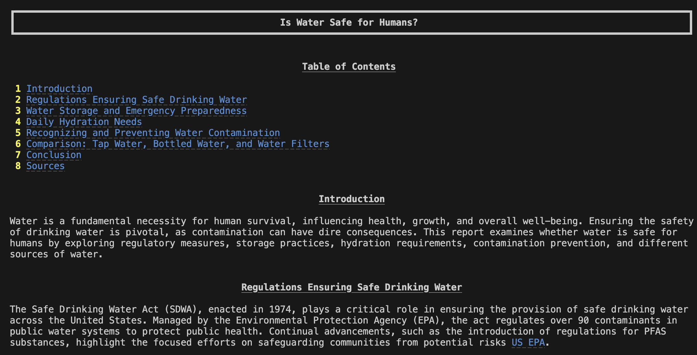

# Deep Research Tool


Example output from the console, include "Table of Content", "Introduction" and the first topic. 

An AI-driven research assistant that performs multi-layered research on any given topic. Using intelligent agents and web scraping capabilities, it can generate a comprehensive report with citations.

## Workflow:

### 1. Query Analysis & Generation
- **Query Agent**: Analyzes your topic and generates 3 targeted search queries

### 2. Web Search & Content Analysis
- **Search Agent**: Performs web searches using DuckDuckGo
- Extracts key information with intelligent filtering (up to 5 sources per query)

### 3. Intelligent Follow-up Research
- **Follow-up Agent**: Identifies research gaps and generates deeper queries
- Conducts up to 3 research iterations for comprehensive coverage

### 4. Report Synthesis
- **Synthesis Agent**: Combines findings into a coherent, structured report
- Generates markdown documents with table of contents, citations, and actionable insights

## Installation

1. Clone the repository:
```bash
git clone https://github.com/Junhao-Han/deep-search.git
cd deep-search
```

2. Create a virtual environment:
```bash
python -m venv env
source env/bin/activate  # On macOS/Linux
env\Scripts\activate     # On Windows
```

3. Install dependencies:
```bash
pip install -r requirements.txt
```

4. Set up environment variables:
Create a `.env` file in the root directory with your OpenAI API key:
```
OPENAI_API_KEY=your_api_key_here
```
